<!--
  ╔═══════════════════════════════════════════════════════════════════╗
  ║  NISHANT JOSHI · GitHub profile README                            ║
  ║  Design system: "Engineered Dark · Editorial Terminal"            ║
  ║  ink #0A0A0B · paper #EDEDE7 · dim #ACAAAD · acid-lime #C6F24E     ║
  ║  Drop this file + /assets into the nishantjoshi-007 repo root.    ║
  ║  Setup + options: see SETUP.md                                    ║
  ╚═══════════════════════════════════════════════════════════════════╝
-->

<!-- ░░░░░░░░░░░░░░░░░░░░  HERO  ░░░░░░░░░░░░░░░░░░░░ -->

<p align="center">
  
</p>

> **I design and build full-stack & AI products**, from generative travel planning to local-first video dubbing. I turn complex ideas into things people actually use.

<br />

<!-- ░░░░░░░░░░░░░░░░░░░░  01 · WHOAMI  ░░░░░░░░░░░░░░░░░░░░ -->

## whoami

```ts
const nishant = {
  role: "Full-Stack & AI Engineer",
  recent: "Software Developer @ Contempo Space", // Mar to Jun 2026, sole developer
  based: "Edison, NJ", // 40.5187° N / 74.4121° W
  education: "B.S. Computer Science · NJIT '25", // minor: Data Analytics
  focus: ["AI / ML systems", "full-stack web & mobile", "developer tooling"],
  stack: ["Python", "TypeScript", "React / RN", "FastAPI", "Node", "Postgres", "AWS"],
  philosophy: "Make the complex feel effortless.",
  status: "OPEN TO OPPORTUNITIES",
};
```

<p align="center">
  
  
  
  
</p>

<br />

<!-- ░░░░░░░░░░░░░░░░░░░░  02 · SELECTED WORK  ░░░░░░░░░░░░░░░░░░░░ -->

## Selected work

| Project                                                    | What it is                                                                                                                                                                                                                        | Stack                                                         |
| ---------------------------------------------------------- | --------------------------------------------------------------------------------------------------------------------------------------------------------------------------------------------------------------------------------- | ------------------------------------------------------------- |
| **[TasteTrail](https://tastetrail.nishantjoshi.me/)**      | Cross-platform culinary discovery: personalized recipes plus a nearby restaurant finder. **7.65K downloads · 112K impressions.**                                                                                                  | `React Native` · `Expo` · `FastAPI` · `Supabase`              |
| **[TRAVaiL](https://travail.nishantjoshi.me/)**            | AI travel orchestration: turns natural-language intent into multi-day itineraries, balancing budget and pace in real time. **Live.**                                                                                              | `React` · `Django` · `OpenAI` · `MongoDB`                     |
| **[Respeak](https://github.com/nishantjoshi-007/Respeak)** | Local-first video dubbing: faster-whisper transcribes, Argos translates offline, Kokoro or Chatterbox re-voices, ffmpeg builds the MP4. Open-source models only, no paid API. **359 offline tests, CI on three Python versions.** | `Python` · `FastAPI` · `faster-whisper` · `ffmpeg` · `Docker` |
| **[CarVis](https://carvis-dashboard.onrender.com/)**       | Car-market analytics on a PostgreSQL star schema, with a full ETL pipeline and a gradient-boosting price model. **Live.**                                                                                                         | `Python` · `PostgreSQL` · `Dash` · `scikit-learn` · `Docker`  |

<details>
  <summary><b>&nbsp;▸&nbsp; In production: internal tools @ NJIT Career Development Services</b></summary>

<br />

- **OutcomesHub** &nbsp;·&nbsp; `Node/Express` `PostgreSQL` `Chart.js`: consolidates graduation outcomes from 7–8 sources with RBAC, CSV ingestion & rollback. Holds **15–17K records** and cut reporting from **1–4 hours → ~10–30 min**.
- **EPI** &nbsp;·&nbsp; `React` `TypeScript` `Supabase` `Recharts`: employer-engagement dashboard with tiered scoring and Jaro-Winkler fuzzy company matching across **700+ employers**, with upload rollback & merge tooling.
- **CFM** &nbsp;·&nbsp; `React` `Supabase`: realtime career-fair check-in with kiosk mode & employer search; scaled to **210+ employers / 750–800 reps**, cutting check-in from **1.5–2 min → 30–40 sec**.
- **TrackIT** &nbsp;·&nbsp; `FastAPI` `Supabase`: equipment inventory for laptops, projectors, DYMO printers and consumables, with admin controls and notifications. **Adopted by 17 staff.**

</details>

<br />

<!-- ░░░░░░░░░░░░░░░░░░░░  03 · STACK  ░░░░░░░░░░░░░░░░░░░░ -->

## Tools of the trade

<table>
  <tr>
    <td><b>Languages</b></td>
    <td>
      
      
      
      
      
    </td>
  </tr>
  <tr>
    <td><b>Frontend</b></td>
    <td>
      
      
      
      
      
      
    </td>
  </tr>
  <tr>
    <td><b>Backend</b></td>
    <td>
      
      
      
      
      
    </td>
  </tr>
  <tr>
    <td><b>AI / ML</b></td>
    <td>
      
      
      
      
      
    </td>
  </tr>
  <tr>
    <td><b>Data & Cloud</b></td>
    <td>
      
      
      
      
      
      
    </td>
  </tr>
  <tr>
    <td><b>Tooling</b></td>
    <td>
      
      
      
      
      
    </td>
  </tr>
</table>

<br />

<!-- ░░░░░░░░░░░░░░░░░░░░  04 · TELEMETRY  ░░░░░░░░░░░░░░░░░░░░ -->

<!--
`04 · TELEMETRY`
## GitHub signal

<p align="center">
  
  
</p>

<p align="center">
  
</p>

<p align="center">
  
</p>

<br />
-->

<!-- ░░░░░░░░░░░░░░░░░░░░  04 · CONTACT  ░░░░░░░░░░░░░░░░░░░░ -->

## Let's build something worth shipping

<p>
  <a href="https://linkedin.com/in/nishant-joshi-"></a>
  <a href="https://nishantjoshi.me"></a>
  <a href="mailto:contact@nishantjoshi.me"></a>
  <a href="https://buymeacoffee.com/nishant.joshi"></a>
</p>

I'm open to full-time roles and ambitious collaborations. Tell me what you're building and I'll get back to you within a day.

<br />

<!-- ░░░░░░░░░░░░░░░░░░░░  FOOTER  ░░░░░░░░░░░░░░░░░░░░ -->

<p align="center"><sub><code>© 2026 · NISHANT JOSHI · built with caffeine &amp; curiosity</code></sub></p>

<p align="center">
  
</p>
